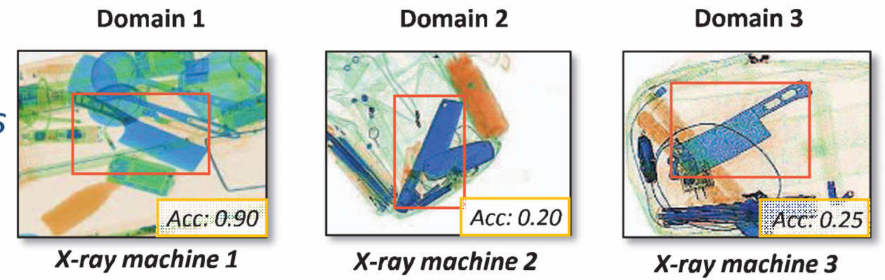

# EDS dataset and the code implementation of PSN

CVPR 2022 paper 《**Exploring Endogenous Shift for Cross-domain Detection: A Large-scale Benchmark and Perturbation Suppression Network**》

[English](README.md) | [简体中文](README_ZH.md)

## Download Link of EDS Dataset:

Please follow the instructions in: https://github.com/DIG-Beihang/XrayDetection to obtain the EDS download link.

## Cross-domain Transfer Learning

A key feature of this repository is its support for **cross-domain transfer learning across different X-ray imaging domains**. Users can conveniently specify different source and target domains through command-line arguments such as `--dataset` and `--datasets`, without manually modifying the training pipeline.

For example, a model can be trained on one X-ray domain and transferred to another domain with different imaging characteristics, device types, or data distributions:

```bash
python train.py \
    --dataset domain1 \
    --datasets domain2
```

By changing the values of `--dataset` and `--datasets`, users can flexibly construct different source-to-target transfer settings, such as `domain1 → domain2`, `domain1 → domain3`, or other cross-domain combinations supported by the dataset.

Different domains may exhibit substantial distribution shifts caused by different X-ray machines, imaging parameters, object appearances, and acquisition environments, as illustrated below:

<p align="center">
  
</p>

<p align="center">
  <em>Example of domain shifts across different X-ray imaging machines.</em>
</p>

This design enables users to conveniently evaluate and adapt detection models under different domain settings, providing flexible support for studying **cross-domain transferability, domain adaptation, and model generalization** in practical X-ray detection scenarios.

## Prerequisites

- Python 3.6
- Pytorch 0.4.1
- CUDA 8.0 or higher

## Compile

```bash
pip install -r requirements.txt
cd lib
sh make.sh
```

## Training

The `scripts` folder has all the training scripts. For example, if you want to train an experiment from domain1 to domain2, just run:

```bash
sh scripts/train-1-2-fc.sh
```

## Testing

The `scripts` folder has all the testing scripts. For example, if you want to test a model trained from domain1 to domain2, just run:

```bash
sh scripts/test-all-1-2.sh
```

## Citation

If this work helps your research, please cite the following paper.

```bibtex
@inproceedings{Tao:CVPR22,
  author    = {Renshuai Tao and Hainan Li and Tianbo Wang and Yanlu Wei and Yifu Ding and Bowei Jin and Hongping Zhi and Xianglong Liu and Aishan Liu},
  title     = {Exploring Endogenous Shift for Cross-domain Detection: A Large-scale Benchmark and Perturbation Suppression Network},
  booktitle = {IEEE CVPR},
  year      = {2022},
}
```
